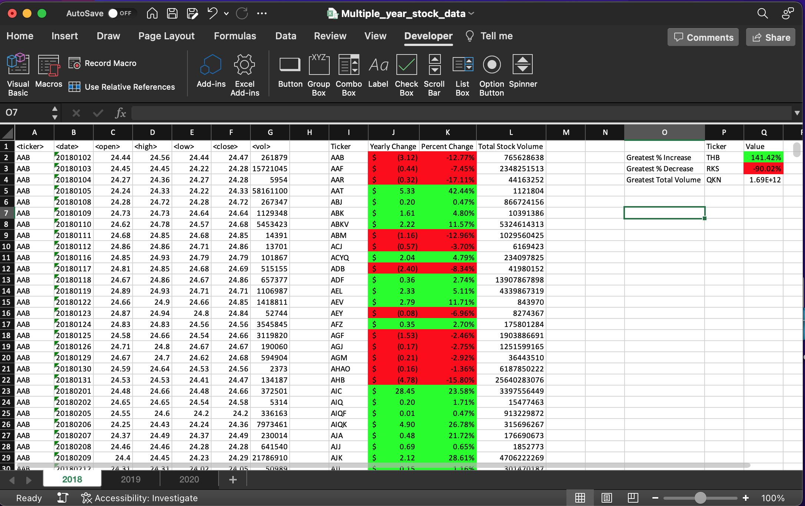

# VBA Challenge

VBA script to create a summary of stock price data provided in an excel file

Following information is summarized for all the stocks
  * The ticker symbol
  * Yearly change from the opening price at the beginning of a given year to the closing price at the end of that year.
  * The percentage change from the opening price at the beginning of a given year to the closing price at the end of that year.
  * The total stock volume of the stock.

Following information is computed based on the summarized data
  * Stock with greatest % price increase
  * Stock with greatest % price decrease
  * Stock greatest total volume

## Assumptions

  * Each worksheet contains data for one year

  * Header column exists and input data is provided in the following order
    * ticker (COL A)
    * date (COL B)
    * open price (COL C)
    * high price (COL D)
    * low price (COL E)
    * close price (COL F)
    * volume (COL G)

  * No Empty rows exist in between the data

  * Stock price data is sorted by ticker symbol and date (ascending order)

## Files

  * Source code:
    * scripts/StockQuoteAnalysis.bas

  * Results screenshots:
    * results_screenshots/2018.png
    * results_screenshots/2019.png
    * results_screenshots/2020.png
  
  * Data:
    * data/alphabetical_testing.xlsx  

## Run Instructions

  * Open Excel file containing the data.

  * Click on 'Developer' tab and open 'Visual Basic'

  * From 'Project Explorer', Right click on 'This Workbook' and click on import

  * Select scripts/StockQuoteAnalysis.bas file to import the VBA code

  * Click on 'Run' button to create the summary

## Sample screenshot

  
